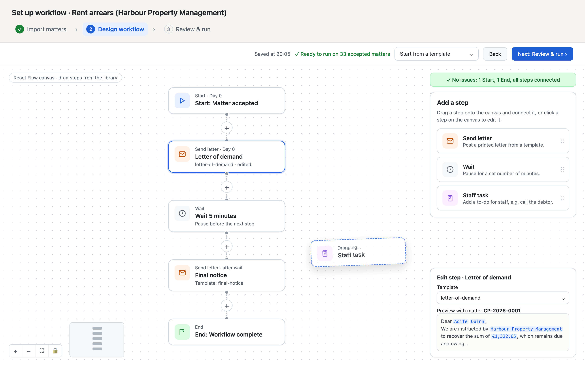

# Ledgerline take-home

Thanks for taking the time to do this. You'll build a small version of **Ledgerline**: importing legal matter instructions from a CSV, reviewing each one, designing a letter workflow on a canvas, running it, and **designing how it would run in production on Azure**.

**We're hiring for strong Azure infrastructure skills as well as application development**, so Part 4 carries as much weight as the app itself. Everything in it can be done for free, and you won't need an Azure subscription.

**Time:** you have up to **3 days** from when you receive this to send it back. There's deliberately more here than most people will polish in that time, so prioritise: a working end-to-end flow beats three perfect screens. When you stop, tell us what you'd do next.

**AI tools:** use whatever you normally would. We recommend **Claude Code with Opus 5.5**. If you already have a subscription, **Codex with GPT-6** is a good alternative. In your README, tell us where they helped and where you had to step in.

We'd suggest watching Matt Pocock's [complete AI coding workflow, end to end](https://www.youtube.com/watch?v=M6mYodf0dJM&t=37s) before you start. It's close to how we work: grill the idea, write a spec, break it into tickets, implement, then code review.

---

## Getting started

You need Node.js 20+ and Docker.

```bash
# 1. Create your own copy: click "Use this template" on GitHub, then clone it
npm install
npm run db:up          # starts Postgres on localhost:5433
cp .env.example .env.local
npm run dev            # http://localhost:3000
```

Check http://localhost:3000/api/health returns `"ok": true`.

### What's in the starter

| Path | What it is |
|---|---|
| `data/matters.csv` | 50 legal matter instructions. **Some rows are bad, missing or ambiguous on purpose.** |
| `templates/*.md` | Three letter templates with `{{placeholders}}` |
| `src/lib/letter-provider.ts` | A stubbed letter provider. `sendLetter()` validates, waits, logs and returns a fake id. **Don't modify it.** |
| `src/lib/templates.ts` | Loads the templates and lists their placeholders |
| `src/lib/db.ts` | A Postgres connection pool. Use it, or bring your own ORM / query builder. |
| `infra/main.bicep` | An empty Bicep file to build your Azure infrastructure from (Part 4) |
| `ARCHITECTURE.md` | Headings for your architecture write-up (Part 4) |
| `docker-compose.yml` | Postgres for local development only. Your production-like compose file is separate (Part 4). |
| `src/app/*` | An app shell with a sidebar and a placeholder page for each route. Replace them with your own. |
| `src/lib/nav.ts` | The sidebar routes. Add, rename or remove routes here. |
| `src/components/ui/*` | [shadcn/ui](https://ui.shadcn.com) components. Add more with `npx shadcn@latest add <name>`. |
| `migrations/` | Empty. Your schema goes here. |

The stack is Next.js, React, TypeScript, Tailwind, [shadcn/ui](https://ui.shadcn.com), Postgres and [React Flow](https://reactflow.dev) (`@xyflow/react`), all installed and wired up. The placeholder pages and routes are a starting point, not a spec, so change them however you like. There are **no database tables**: designing the schema is part of the task.

Useful scripts: `npm run typecheck`, `npm run db:psql` (a psql shell), `npm run db:reset` (deletes all data and starts Postgres with an empty database).

---

## Part 1: Import legal matters (required)

A client firm sends us a CSV of matters to act on. Each row is one person who owes money.

1. **Upload** a CSV file.
2. **Map columns.** Show the CSV's columns and let the user map each one to a field in your schema. Pre-fill obvious matches, but let the user change them.
3. **Validate.** Decide what makes a matter valid. Tidy up anything you can fix safely and automatically, and flag anything you can't.
4. **Review queue.** A legal executive has to approve **every** matter before it goes any further, not just the flagged ones. Show every row, with what was tidied automatically and why anything was flagged. The reviewer clicks **Approve** or **Reject** on each one.
5. **Finish the import.**
   - Only approved matters are saved to the database as matters.
   - Rejected rows can be **downloaded as a CSV**, with a column explaining why each was rejected.

Think about what a real operations person would need: what should never be auto-fixed, what they'd want to see to decide quickly, how to get through a clean file fast without flagged rows getting lost in it, and what happens if the same file is uploaded twice.

## Part 2: Letter workflow canvas (required)

Build a canvas for designing a workflow that runs against imported matters. We recommend **[React Flow](https://reactflow.dev)** (`@xyflow/react`, already installed). These examples cover most of what you need:

- [Drag and drop from a sidebar](https://reactflow.dev/examples/interaction/drag-and-drop)
- [Custom nodes](https://reactflow.dev/learn/customization/custom-nodes)
- [Save and restore](https://reactflow.dev/examples/interaction/save-and-restore)

Here's roughly what we have in mind. Treat it as a guide, not a spec. Change the layout, and improve it if you have better ideas:



1. A **"Add a step" library** on the right. Steps can be dragged from it onto the canvas:
   - **Send letter**: posts a letter using a template
   - **Wait**: pauses for a set number of minutes
   - **Staff task**: creates a to-do for a member of staff, e.g. "Call the debtor"
2. Every workflow has a **Start** node and an **End** node. Connect the nodes with edges to make a flow, e.g. Start → Send letter → Wait → Send letter → End.
3. Clicking a **Send letter** node lets the user **pick a template**, **edit its text**, and **preview** it with a real matter's data filled in.
4. **Validate** the workflow before it can run, e.g. exactly one Start and one End, every step connected, no dead ends. Show what needs fixing.
5. **Save** a workflow and **load it back**.

## Part 3: Run the workflow (required)

1. Run a saved workflow against the matters approved in Part 1.
2. Each matter moves through the steps independently:
   - **Send letter** renders the template for that matter and calls `sendLetter()`
   - **Wait** pauses that matter for the configured minutes
   - **Staff task** creates a task that staff can see and tick off
3. Show the **progress of each matter**: which step it's on, what's been sent (with the provider id), and anything that failed. `sendLetter()` throws on bad input, such as a missing address, so handle that sensibly.
4. Runs should **survive a server restart**. If you stop `npm run dev` halfway through a Wait, the matters should carry on when it starts again.

## Stretch goals (optional)

Only if you have time: anything you think would make this more useful to the ops person using it.

---

## Part 4: Production on Azure (required)

This is where we test your **Azure infrastructure skills**. We want to see how you'd run Ledgerline in production: securely, privately and repeatably. You don't need to spend anything. Everything below runs locally or compiles offline.

### 4a. A production-like Docker setup

Add a `Dockerfile` and a `docker-compose.prod.yml` that run the app the way it would run in Azure:

- **Separate containers** for `web` (the Next.js app), `worker` (the workflow runner from Part 3), `db` (Postgres) and `storage` ([Azurite](https://learn.microsoft.com/azure/storage/common/storage-use-azurite), Microsoft's Azure Storage emulator; use it for uploaded and rejected CSVs).
- Run the **production build**, not `npm run dev`.
- **Two networks**, mirroring subnets: a public-facing one and a private one. The database and storage must **not** be reachable from the public side.
- **Secrets come from files** (Docker secrets or mounted files), never hard-coded or committed. Add `secrets/` examples to your README, not to git.
- `docker compose -f docker-compose.prod.yml up` should bring everything up from a clean clone, with migrations running automatically.

### 4b. Azure infrastructure as code

In `infra/`, write **Bicep** for the full production setup. We're deliberately not giving you a list of services: choosing them is part of the task. Whatever you pick, the setup must meet these requirements:

- **The database and storage are private.** Nothing outside your network can reach them, not even with the right credentials.
- **No secrets in code or app settings.** The apps get what they need using their own identity, and secrets can be rotated without a redeploy.
- **Staff sign in** with their work accounts before they can use the app.
- **The public app is protected** against common web attacks and abusive traffic.
- **`web` and `worker` run and scale separately.**
- **Logs and metrics end up somewhere you can search and alert on.**

In `ARCHITECTURE.md`, say which services you chose for each requirement and why. If a piece can't be done in Bicep, document the manual steps instead.

Check it compiles and passes the linter. This is free and needs no subscription:

```bash
az bicep build --file infra/main.bicep
```

We may run `what-if` against our own subscription. You don't need to deploy anything.

### 4c. CI with GitHub Actions

Add a workflow in `.github/workflows/` that runs on every push and:

- installs dependencies, typechecks and runs your tests
- builds the Docker image(s)
- compiles and lints the Bicep

It should pass on your repo. GitHub Actions is free for public repositories.

### 4d. Architecture write-up

Fill in `ARCHITECTURE.md`: a diagram plus a few short paragraphs. Specific beats long.

- Why the database is private-only, and how the app reaches it
- How secrets reach the app, and how you'd rotate them
- How a **Wait** survives a deploy or restart
- How you'd run database migrations without downtime
- What you'd monitor, and what should wake someone up at 3am

**Optional bonus:** if you have Azure credit (for example [Azure for Students](https://azure.microsoft.com/free/students), no card needed), you're welcome to actually deploy it and send us the URL. This is entirely optional, and **nobody is marked down for not deploying**.

---

## Submitting

Reply to the person who sent you this with:

1. **A link to your GitHub repo** (public, or private and shared with us).
2. **A README section** covering:
   - how to run it (both `npm run dev` and `docker-compose.prod.yml`) and any setup steps we need
   - your key decisions and trade-offs
   - what you'd do with more time
   - where AI tools helped and where you had to step in

## What we look at

- **Judgement with messy data**: what you fix, what you flag, and why.
- **Schema and code**: readable, typed and sensibly structured, not over-engineered.
- **It works**: we can run it from your README, and import → review → design → run works end to end.
- **The runner**: matters progress independently, failures are visible, and runs survive a restart.
- **UX**: mapping and review are clear, and the canvas is pleasant to use.
- **Azure infrastructure**: a secure, private-by-default design; Bicep that compiles; sensible networking, identity and secrets; CI that actually runs.
- **Communication**: your README makes the trade-offs clear.

Everything in this repo is fictional. No real people, firms or addresses.
